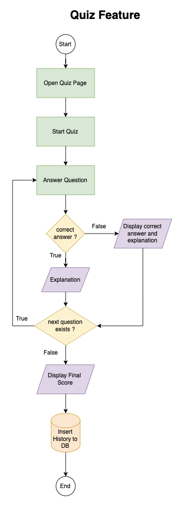
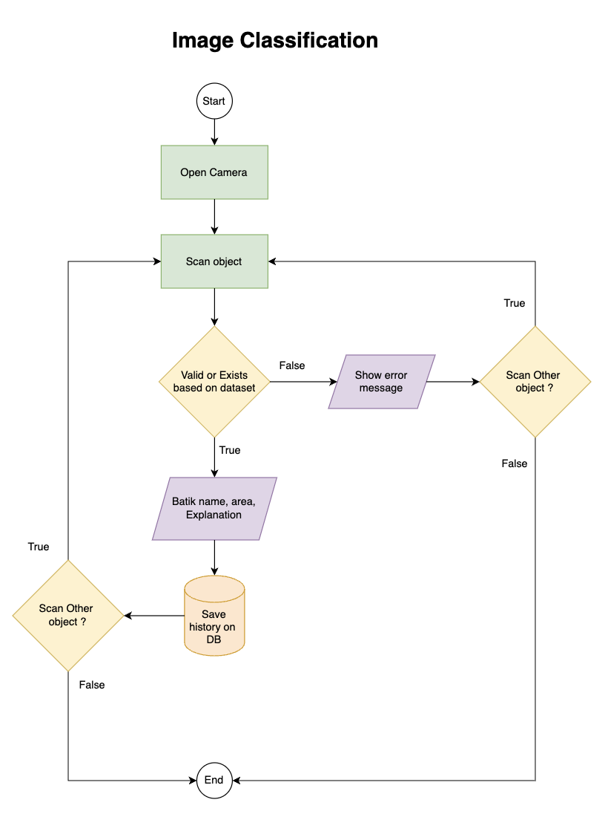
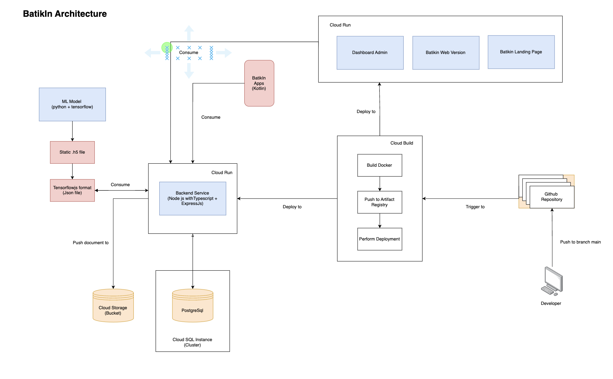

# REST API
# BatikIn

BatikIn is a project focused on Batik Image Recognition and Education. It aims to provide a platform for recognizing and learning about various Batik patterns. This repository contains the backend API for the BatikIn application.

## Documentation

The API documentation for BatikIn can be found [here](https://documenter.getpostman.com/view/16118842/2s93shz9Nf). It provides detailed information about the available endpoints, request/response formats, and authentication requirements.

## API Features

The BatikIn API Backend offers the following features:

- **Authentication API:** Include Login and Register, This API allows users to authenticate themselves using their registered account
- **User API:** Provides endpoints for update user data like photo profile, address, phone number, etc.
- **Image Classification API:** Include API to Classify image and Show classification history
- **Article  API:** Allows users to access educational resources related to Batik for Articles and Favorite Articles Feature
- **Quiz  API:** Allows users to access educational resources related to Batik for Quiz Feature

## Flowchart

Here some flowchart on our feature : 

- **Quiz**

- **Image Classification**

## Cloud Architecture 

Our overall cloud architecture looks like this : 

